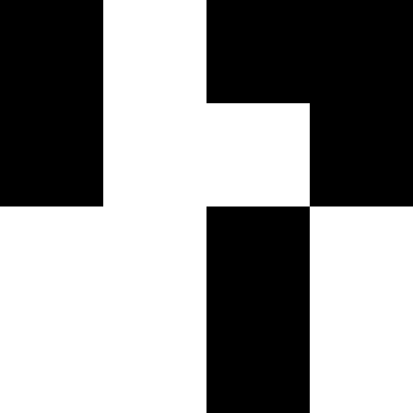
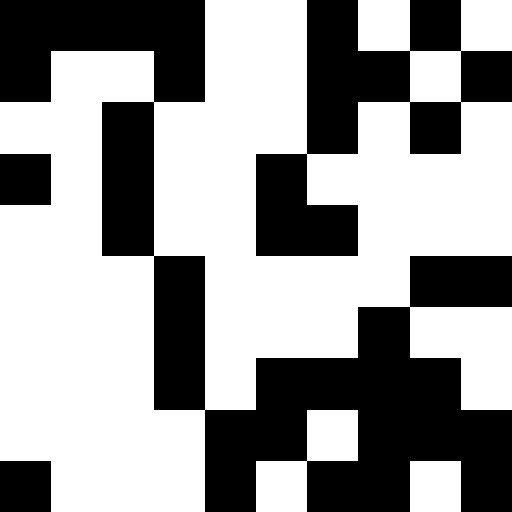

# DailyPixelPerfect

Generation of pixelated images!

- Channel: https://t.me/DailyPixelPerfect
- Bot: https://t.me/pixelperfectbot
- Contact: https://t.me/Stache

## Setup

1. Clone the repo, `cd` into it.
2. `python -m venv ./env; source ./env/bin/activate`
3. `pip install -r requirements.txt`
4. `cp dailypixelperfect/secret.py.dist dailypixelperfect/secret.py` and add:
   - BOT_TOKEN = Your bot token.
   - ADMIN_ID = Your ID.
   - CHANNEL_ID = Your channel ID.
5. Then start the bot using `wsgi.py`

## Usage

In the bot:
- /start, /help: Show this message.
- /generate <size> <number>: Generates an image of size <size> for the number <number>.
- /random: Generates a random image.
- /channel_start <size> <number>: (Admin only) Allows you to start generating images every hour on the configured channel.

